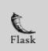
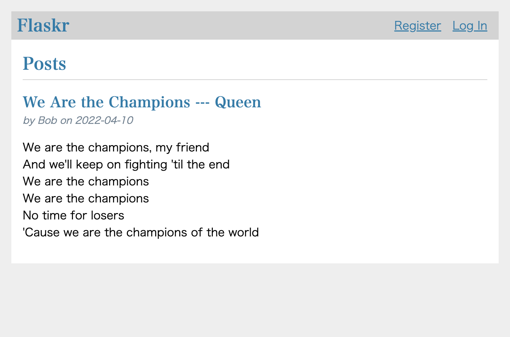
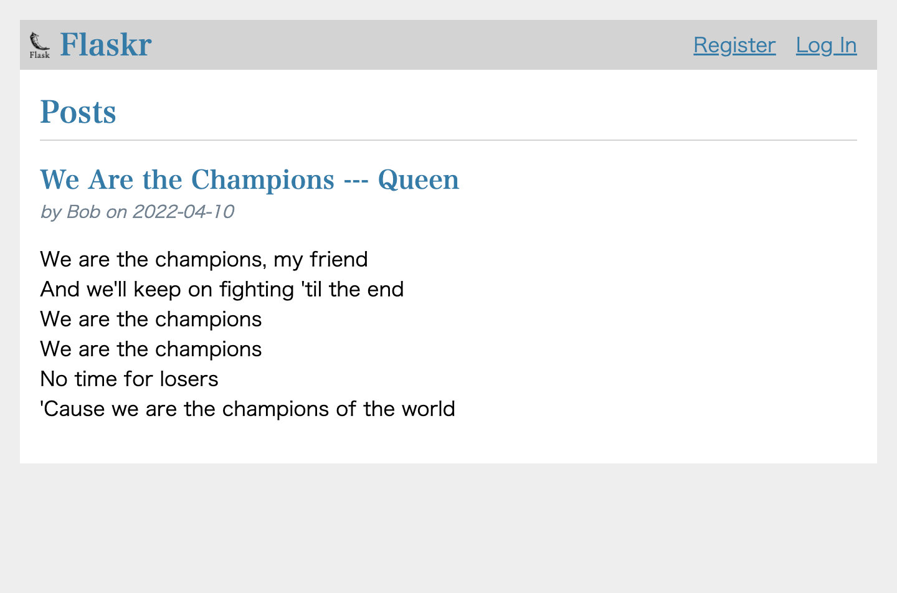
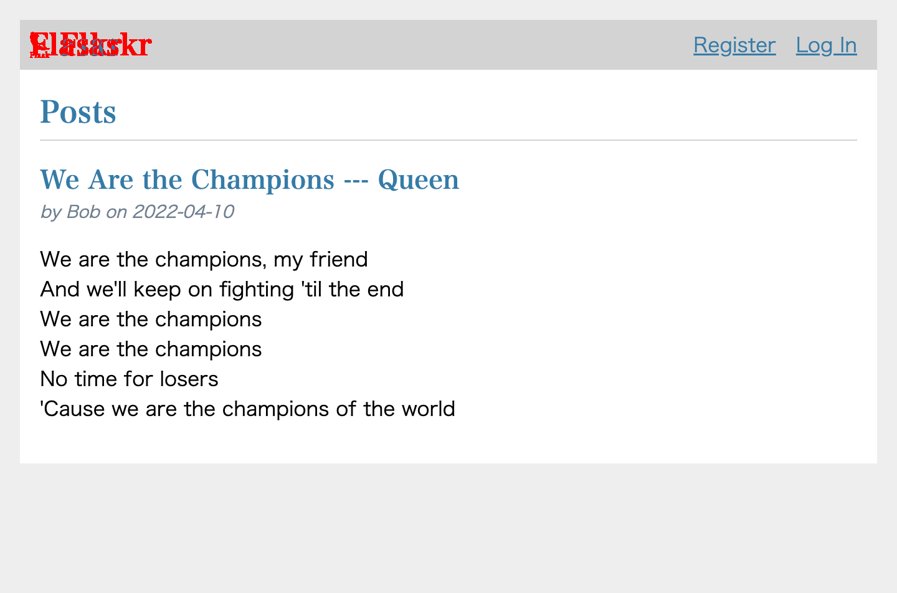
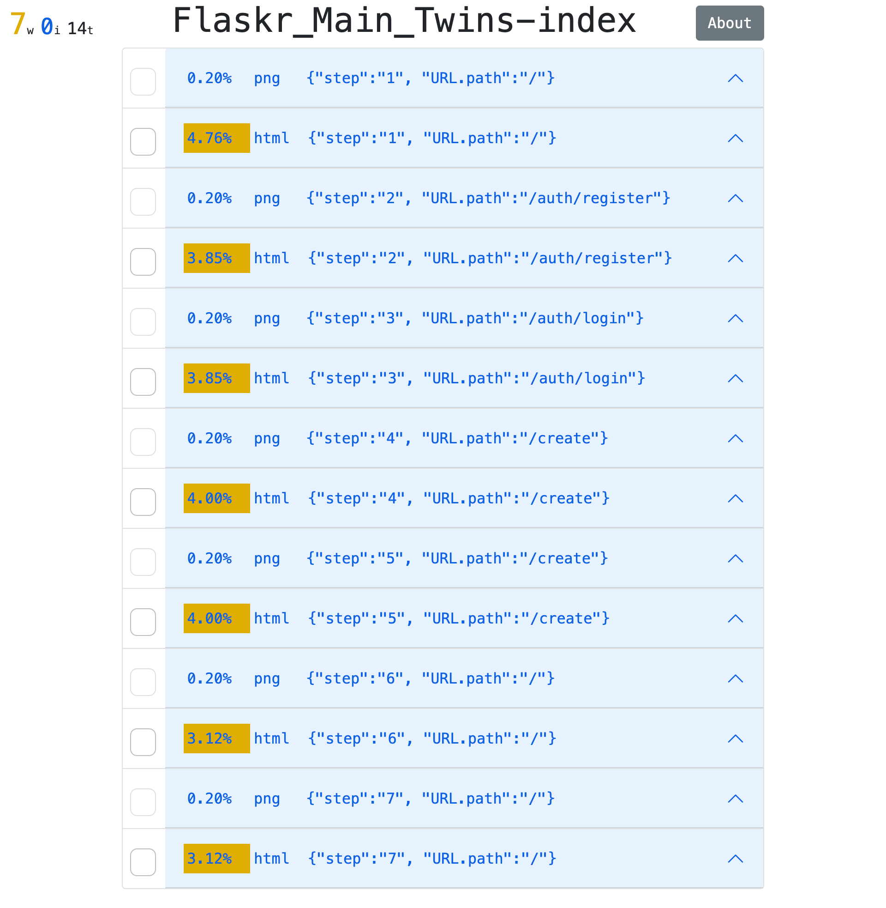

= Visual Inspection with Page Object Model in Katalon Studio

author: kazurayam
date: 20 April 2022

== Problem to solve

I have developed a Katalon Studio project named link:https://github.com/kazurayam/VisualInspectionInKatalonStudio_Reborn[VisualInspectionInKatalonStudio_reborn]. 

In that project I developed 3 sample codes:

- link:https://github.com/kazurayam/VisualInspectionInKatalonStudio_Reborn#sample1-simply-visit-a-url-and-scrape[Sample1 Simply visit a URL and scrape]
- link:https://github.com/kazurayam/VisualInspectionInKatalonStudio_Reborn#sample2-visual-inspection-in-chronos-mode[Sample2 VisualInspectionInChronosMode]
- link:https://github.com/kazurayam/VisualInspectionInKatalonStudio_Reborn#sample3-visual-inspection-in-twins-mode[Sample3 Visual Inspection in Twins mode]

In these samples, test code opens just one or two URLs. I would like to add another type of sample code (namely, Sample4) of Visual Inspection. The sample4 shows how to navigate through a web site that consists of 7 or more views. The sample4 will visit the multiple URLs while taking screenshots and saving HTML sources. I would introduce a design pattern named "POM" (Page Object Model) into the sample4. The sample4 shows how to compare multiple pairs of URLs. 

== Solution

=== What the test case does?

The test case link:https://github.com/kazurayam/VisualInspection_with_PageObjectModel_in_KatalonStudio/blob/master/Scripts/main/Flaskr/Main_Twins/Script1646271527599.groovy[Test Cases/main/Flaskr/Main_Twins] does the following:

1. It compares 2 web sites visually: `http://127.0.0.1:3080` and `http://127.0.0.1:3090`. 
- (You are supposed to setup these URLs on your PC locally. I will explain how to later in this document.)
2. A web application named **Flakr** runs on the URLs. Let me call `http://127.0.0.1:3080` as "Flaskr *Prod env*", and `http://127.0.0.1:3090` as "Flaskr *Dev env*". These 2 URLs have just the same functionality. But the pages look slightly different. The production environment has no site logo, but the development environment has a small site logo image. 
 
- the Prod env

- the Dev env

3. The test case starts with the index page, then navigates through pages by clicking menu anchors, typing texts, clicking buttons, etc.

[cols="4*", options="header"]
.URLs to visit
|===
|Step|description|Prod env URL|Dev env URL

|step1
|index page
|http://127.0.0.1:3080/
|http://127.0.0.1:3090/

|step2
|register credential
|http://127.0.0.1:3080/auth/register
|http://127.0.0.1:3090/auth/register

|step3
|log in
|http://127.0.0.1:3080/auth/login
|http://127.0.0.1:3090/auth/login

|step4
|posting - blank
|http://127.0.0.1:3080/create
|http://127.0.0.1:3090/create

|step5
|posting - text typed
|http://127.0.0.1:3080/create
|http://127.0.0.1:3090/create

|step6
|list of blogs
|http://127.0.0.1:3080/
|http://127.0.0.1:3090/

|step7
|log out
|http://127.0.0.1:3080/
|http://127.0.0.1:3090/

|===

4. The test case compares each pairs of URLs and generates diff images. The following is an example of a diff image. Please find the section on the top-left side painted red, which is the diff. 

5. The test case generates a HTML report which shows a list all of the materials (screenshot images and HTML page sources) attached with detail diff information. You can find an example link:https://kazurayam.github.io/VisualInspection_with_PageObjectModel_in_KatalonStudio/store/Flaskr_Main_Twins-index.html[here].

=== How to run the test

Just open the "Test Cases/Flaskr/VisualInspectionTwins" and run it. As default Chrome Headless browser git will be used, but you can choose any browser. You can choose any Execution Profile. The test won't be affected by the profile you chose.

The test case will take approximately 30 seconds to finish.

The test case will write the report in the `<projectDir>/store/Flaskr_VisualInspectionTwins-index.html` file.

== Description

=== What is the Flaskr app?

Flaskr is coded in Python language on top of the "Flask" web application framework. I learned the Flaskr web app at the link:https://flask.palletsprojects.com/en/2.0.x/tutorial/[Flask Tutorial] authored and published by the Pallets project.

____
This tutorial will walk you through creating a basic blog application called Flaskr. Users will be able to register, log in, create posts, and edit or delete their own posts. 
____

I used the Flasrk source code 99% as is. I amended it slightly to display the site logo in the Dev env only.

=== How the test is coded

The sample4 is designed to be highly extensible while avoiding code publications as much as possible. It would be a foundation of large scale Visual Inspection projects.

You can read the sources

- link:https://github.com/kazurayam/VisualInspection_with_PageObjectModel_in_KatalonStudio/blob/master/Scripts/main/Flaskr/Main_Twins/Script1646271527599.groovy[Test Cases/main/Flaskr/Main_Twins]
- link:https://github.com/kazurayam/VisualInspection_with_PageObjectModel_in_KatalonStudio/blob/master/Scripts/main/Flaskr/materialize/Script1645868375656.groovy[Test Cases/main/Flaskr/materialize]
- link:https://github.com/kazurayam/VisualInspection_with_PageObjectModel_in_KatalonStudio/blob/master/Scripts/main/Flaskr/reduceTwins/Script1650172681527.groovy[Test Cases/main/Flaskr/reduceTwins]
- link:https://github.com/kazurayam/VisualInspection_with_PageObjectModel_in_KatalonStudio/blob/master/Scripts/main/Flaskr/report/Script1646272301192.groovy[Test Cases/main/Flaskr/report]

and a lot of related Groovy classes:

- link:https://github.com/kazurayam/VisualInspection_with_PageObjectModel_in_KatalonStudio/blob/master/Include/scripts/groovy/com/kazurayam/uitestjava/flaskr/pom/actions/Action.java[pom/actions/Action.groovy]
- link:https://github.com/kazurayam/VisualInspection_with_PageObjectModel_in_KatalonStudio/blob/master/Include/scripts/groovy/com/kazurayam/uitestjava/flaskr/pom/actions/ActionListener.groovy[pom/actions/ActionListener.groovy]
- link:https://github.com/kazurayam/VisualInspection_with_PageObjectModel_in_KatalonStudio/blob/master/Include/scripts/groovy/com/kazurayam/uitestjava/flaskr/pom/actions/ActionListenerBaseImpl.groovy[pom/actions/ActionListenerBaseImpl.groovy]
- link:https://github.com/kazurayam/VisualInspection_with_PageObjectModel_in_KatalonStudio/blob/master/Include/scripts/groovy/com/kazurayam/uitestjava/flaskr/pom/actions/LoginAction.groovy[pom/actions/LoginAction.groovy]
- link:https://github.com/kazurayam/VisualInspection_with_PageObjectModel_in_KatalonStudio/blob/master/Include/scripts/groovy/com/kazurayam/uitestjava/flaskr/pom/actions/LogoutAction.groovy[pom/actions/LogoutAction.groovy]
- link:https://github.com/kazurayam/VisualInspection_with_PageObjectModel_in_KatalonStudio/blob/master/Include/scripts/groovy/com/kazurayam/uitestjava/flaskr/pom/actions/PostAction.groovy[pom/actions/PostAction.groovy]
- link:https://github.com/kazurayam/VisualInspection_with_PageObjectModel_in_KatalonStudio/blob/master/Include/scripts/groovy/com/kazurayam/uitestjava/flaskr/pom/data/Song.groovy[pom/data/Song.groovy]
- link:https://github.com/kazurayam/VisualInspection_with_PageObjectModel_in_KatalonStudio/blob/master/Include/scripts/groovy/com/kazurayam/uitestjava/flaskr/pom/data/Songs.groovy[pom/data/Songs.groovy]
- link:https://github.com/kazurayam/VisualInspection_with_PageObjectModel_in_KatalonStudio/blob/master/Include/scripts/groovy/com/kazurayam/uitestjava/flaskr/pom/data/User.groovy[pom/data/User.groovy]
- link:https://github.com/kazurayam/VisualInspection_with_PageObjectModel_in_KatalonStudio/blob/master/Include/scripts/groovy/com/kazurayam/uitestjava/flaskr/pom/pages/auth/LoginPage.groovy[pom/pages/auth/LoginPage.groovy]
- link:https://github.com/kazurayam/VisualInspection_with_PageObjectModel_in_KatalonStudio/blob/master/Include/scripts/groovy/com/kazurayam/uitestjava/flaskr/pom/pages/auth/RegisterCredentialPage.groovy[pom/pages/auth/RegisterCredentialPage.groovy]
- link:https://github.com/kazurayam/VisualInspection_with_PageObjectModel_in_KatalonStudio/blob/master/Include/scripts/groovy/com/kazurayam/uitestjava/flaskr/pom/pages/blog/CreatePostPage.groovy[pom/pages/blog/CreatePostPage.groovy]
- link:https://github.com/kazurayam/VisualInspection_with_PageObjectModel_in_KatalonStudio/blob/master/Include/scripts/groovy/com/kazurayam/uitestjava/flaskr/pom/pages/blog/IndexPage.groovy[pom/pages/blog/IndexPage.groovy]
- link:https://github.com/kazurayam/VisualInspection_with_PageObjectModel_in_KatalonStudio/blob/master/Include/scripts/groovy/com/kazurayam/uitestjava/flaskr/pom/pages/blog/Post.groovy[pom/pages/blog/Post.groovy]

Why do I have these Groovy classes? --- It is because I employed the link:https://www.guru99.com/page-object-model-pom-page-factory-in-selenium-ultimate-guide.html["Page Object Model"]. The Page Object Model helped me in writing compact and readable codes.

The POM classes are developed outside Katalon Studio. I developed the POM classes in the following project:

- https://github.com/kazurayam/MyPythonProjectTemplate/tree/master/uitestjava

and the `importSourceOfFlaskrPOM` task defined in the `build.gradle` copies the source from the origin to this project. 

== Environment setup

In the sample4, we need 2 URLs available on our own PC.

- http://127.0.0.1:3080/
- http://127.0.0.1:3090 

You can make it work on your PC. You need link:https://www.docker.com/[Docker] installed into your PC.

=== Installing Docker Desktop

On my MacBook Air, I installed https://www.docker.com/products/docker-desktop[Docker Desktop]. Docker Desktop for Windows is also available.

=== Command Line Interface

Here I assume you work on a Command Line Interface. I use the Terminal.app of macOS. For Windows user, install https://gitforwindows.org/[Git for Windows] which bundles "Git Bash".

=== Starting up Flaskr

Open a window of Command Line Interface, then execute:

----
$ cd $VisualInspectionInKatalonStudio_Reborn
$ ./startup-flaskr-prod.sh
----

This shell script will emit 2 lines of messages and will block:

----
you can visit http://127.0.0.1/
Serving on http://0.0.0.0:8080
----

Next, you want to open one more window of Command Line Interface, then execute:

----
$ cd $VisualInspectionInKatalonStudio_Reborn
$ ./startup-flaskr-dev.sh
----

This will emit 2 lines of messages and will block:

----
$ ./startup-flaskr-dev.sh
you can visit http://127.0.0.1:3090/
Serving on http://0.0.0.0:8080
----

By `lsof` command, you can make sure that 2 processes are listening to the IP port #80 and #3090 on your localhost.

----
$  lsof -i -P | grep LISTEN | grep com.docke
com.docke   709 kazuakiurayama  107u  IPv6 0x84f53716e8d7cb33      0t0  TCP *:3090 (LISTEN)
com.docke   709 kazuakiurayama  111u  IPv6 0x84f53716e8d771d3      0t0  TCP *:80 (LISTEN)
----

=== Shutting down Flaskr gracefully

You can stop the docker process gracefully by typing CTRL + C.

You should NEVER close the window of Command Line Interface without stopping the docker process by CTLR + C.

If you forced to close the window, then IP Port #80 and #3090 might be left *USED* status. In that case you would fail to start a new process of Flaskr again. When it occurred, you need to stop & restart your PC/OS to release the ports.

=== Initializing Database in the web app

The Flaskr has a backend database where credentials and blog posts are stored. After you repeated running tests several times you will find many blog posts are stored, and you would feel like to clean the database out.

Just type CTRL + C to stop the docker process and restart it. The start-up script will automatically initialize the Flaskr's internal database and make it empty.

=== How I used Docker

Hava a look at the code of link:https://github.com/kazurayam/VisualInspection_with_PageObjectModel_in_KatalonStudio/blob/master/Test%20Listeners/TLFlasrk.groovy[TLFlaskr.groovy]:

This code runs `docker run` command with a docker image `kazurayam/flaskr-kazurayam:1.1.0`. I created this docker image and published at the https://hub.docker.com/repository/docker/kazurayam/flaskr-kazurayam[Docker Hub].

